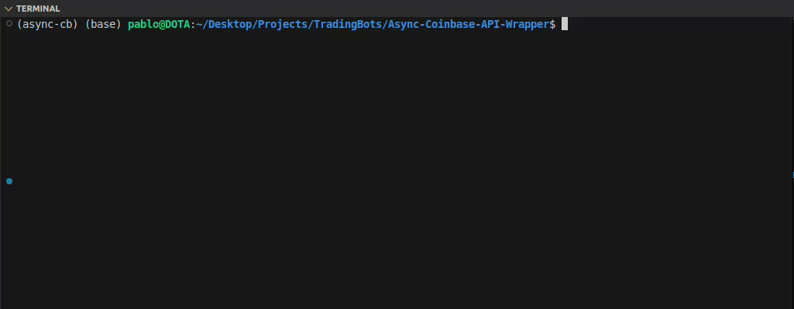

# Async-Coinbase-API-Wrapper

A Python wrapper for the Coinbase API that supports asynchronous API calls and real-time task monitoring.

## Overview

This project provides an easy-to-use interface for making asynchronous requests to the Coinbase API, allowing for efficient, non-blocking API operations. The wrapper includes features for tracking and monitoring API calls, including the state and progress of each task.

## Features

- Asynchronous API calls using `asyncio`
- Real-time task monitoring with detailed status updates
- Unique task IDs with timestamps for easy tracking

## Getting Started

1. Clone the repository.
2. Install the dependencies listed in `requirements.txt`.
3. Follow the example scripts in the `examples/` directory to start making asynchronous API calls.

